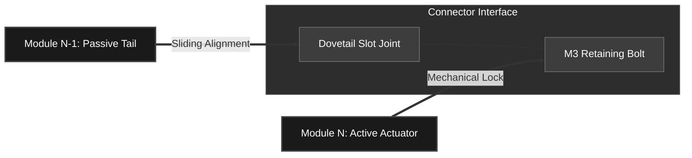

# SALLI: Mechanical CAD & Bio-Inspired Designs

This directory contains the entire three-dimensional mechanical framework of SALLI. The structural engineering is tailored for high accessibility, durability, and rapid assembly, allowing students and researchers to fabricate a bio-inspired robot using standard **Fused Deposition Modeling (FDM) 3D printers**.

---

## Directory Mapping & Module Functions

To accommodate global developers, the folder names are kept in Spanish as generated by our design pipeline, but correspond to the following technical subsystems:

| Folder Name | English Designation | Core Mechanical Role |
| :--- | :--- | :--- |
| `Cabeza V3` | **Head Module V3** | Houses the primary ESP32-C3 processor, sensory electronics, power switch routing, and visual streaming camera. |
| `Oscilatorio V4` | **Oscillatory Spine V4** | Standardized vertebrae module that provides one horizontal rotary Degree of Freedom (DoF) to form the lateral undulations of the spine. |
| `Módulo de Patas V3` | **Sprawling Leg Module V3** | Houses the micro servos responsible for controlling the crawling limbs, transforming standard rotary motion into forward driving force. |
| `Cola` | **Tail Module** | A series of passive/active segments that balance center of mass shifts and provide inertial stabilization. |
| `Patines` | **Underbody Slides / Skates** | Passive support structures positioned along the belly to minimize frictional dragging forces and maintain consistent ground clearance. |
| `Ensamble Total` | **Master CAD Assembly** | Complete workspace containing tolerances, fast assembly fasteners, and inter-segment limits. |

---

## Mechanical Modularity Philosophy

The backbone of SALLI relies on a **dovetail-inspired sliding locking mechanism** secured with standard metric machine screws. 

* **No Glue Required:** All connections are held in place mechanically, ensuring that cracked components can be easily unscrewed, reprinted, and replaced.
* **Symmetrical Design:** The spinal modules share symmetrical left/right geometry, minimizing the unique parts inventory required for manufacturing.
* **Adaptive Kinematics:** By modifying the number of `Oscilatorio` modules, you can alter the physical body length, shifting the gait dynamics from a compact lizard style to an elongated serpentine flow.

---

## Manufacturing & FDM Print Specifications

To achieve optimal strength-to-weight ratios without requiring industrial printers, we recommend printing the parts using the following settings:

* **Material:** **PETG** (Highly recommended for high impact strength and natural flex tolerance under heavy joint torques) or **PLA+** (for easy printing with high tensile strength).
* **Layer Height:** `0.2 mm` (Balanced speed and feature tolerance).
* **Infill Density:** * Spine/Structural parts: `30%` Gyroid or Grid infill.
* Leg linkages/Connectors: `50%` Gyroid infill (Crucial for withstanding torsional shear stress).

* **Wall Lines:** Minimum `3` perimeter loops.
* **Orientation:** Print all modules with their flat connector faces touching the build plate to eliminate the need for excessive support structures.

---

## Hardware Fasteners Bill of Materials (BOM)

To assemble the CAD files, ensure you have the following hardware:

* **Screws:** M3 socket head screws (various lengths: $8\text{ mm}$, $12\text{ mm}$, and $16\text{ mm}$).
* **Nuts:** M3 hex locknuts (nyloc recommended to prevent loosening from walking vibrations).
* **Servos:** High-torque metal-geared micro servos (e.g., MG90S or compatible standard micro-sizes).
