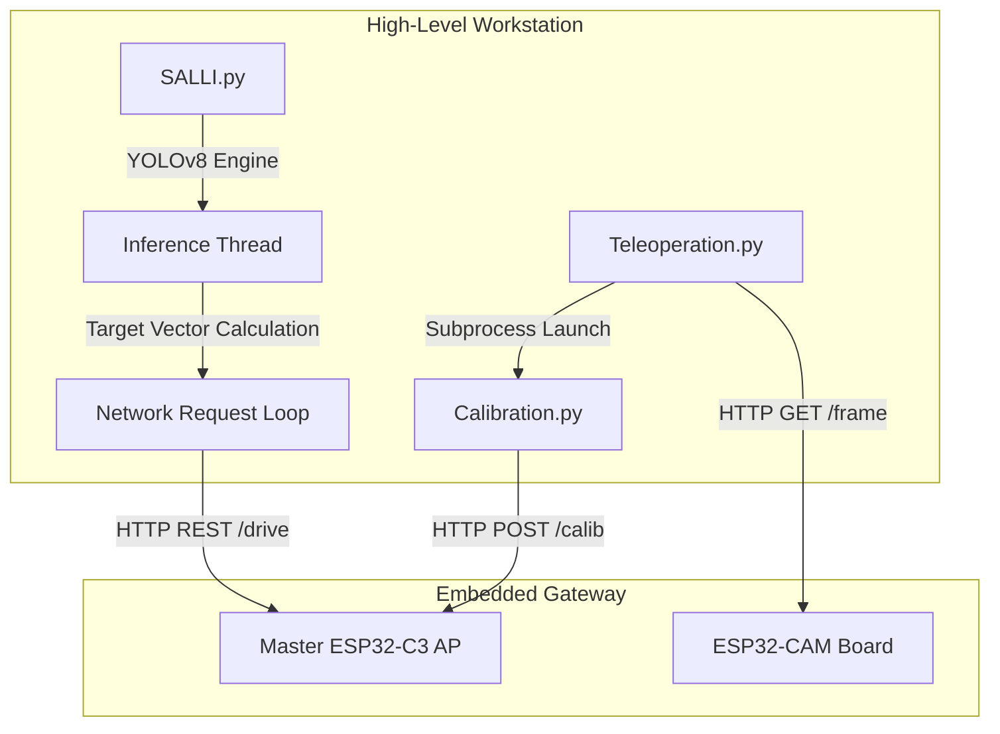

# SALLI: Python High-Level Control Codes

This directory contains the high-level Python software suite designed to orchestrate SALLI's telemetry, user interaction, automated object-tracking loops, and physical joint calibration. These components interface directly with the ESP32-C3 master microcontroller over local network protocols to close the control loop.

---

## Software Component Architecture

The Python workstation layer processes non-real-time heavy computations (such as deep learning inference and graphic user interfaces) and communicates with SALLI's local Wi-Fi gateway.



### 1. SALLI.py: Vision-Based Autonomous Navigator

This application establishes an autonomous closed-loop tracking system using a local webcam or HTTP camera stream. It utilizes a custom-trained **YOLO (You Only Look Once)** object detection network to identify targets and dynamically adjust the robot's locomotion vector.

* **Asynchronous Deep Learning Inference:** A dedicated background thread runs the YOLO engine (`my_model.pt`) on incoming image buffers, maintaining frame-rate stability on the main UI thread.
* **Proportional Target Tracking:** Translates spatial coordinate deviations of target bounding boxes into steering adjustments and speed curves.
* **Proximity Stop Safeguards:** Automatically switches states to idle/stop when the target bounding box area exceeds a safety threshold, preventing physical collisions.

### 2. Teleoperation.py: Interactive Driver Station

Provides a graphical user interface (GUI) developed in Tkinter with a dark palette.

* **Asynchronous Video Stream Receiver:** Connects to an external ESP32-CAM module, pulling JPEG frames continuously via HTTP GET requests and dynamically resizing the viewport buffer to maintain low latencies.
* **Remote Mode Transitioning:** Sends immediate state changes to the master robot, switching operating modes (`calib`, `preview`, `run`) via high-speed HTTP parameters.
* **Dynamic Controller Spawning:** Spawns the calibration tool as an independent sub-process, ensuring modular execution.

### 3. Calibration.py: Joint Offset Tuner

Compensates for mechanical assembly tolerances and variations across budget analog micro-servos.

* **Trimming Array Constructor:** Allows users to adjust mechanical offsets for 14 independent servo lines divided into logical anatomical groups:
* Left and Right Limbs (`p1` through `p8`)
* Anterior and Posterior Vertebrae (`o1` through `o6`)


* **NVS Serializer:** Collects active slider adjustments and structures a serialized JSON payload transmitted via HTTP POST. This configuration is written directly to the non-volatile storage (NVS) partition of the ESP32-C3 chip.

---

## Mathematical Formulations

To ensure a high level of technical rigor, the mechanical, kinematic, and vision processing layers are governed by the following mathematical frameworks.

### 1. Servo Offset Projection Model

Let $\theta_{\text{logical}, i}$ be the abstract, mathematically calculated joint angle outputted by the locomotion algorithm for servo $i$, where $\theta_{\text{logical}, i} \in [-90^\circ, 90^\circ]$.

Due to physical mounting misalignments, a pure logical angle does not map to a physically straight joint. We define $\theta_{\text{base}} = 90^\circ$ as the physical midpoint of the servo's standard $180^\circ$ range. The final commanded angle transmitted to the physical actuator $\theta_{\text{target}, i}$ is calculated as:

$$\theta_{\text{target}, i} = \theta_{\text{logical}, i} + \theta_{\text{base}} + \Delta\theta_i$$

Where:

* $\Delta\theta_i \in [-45^\circ, 45^\circ]$ represents the calibration trim offset for servo $i$, modified in `Calibration.py`.

During calibration mode, the software enforces $\theta_{\text{logical}, i} = 0^\circ$. Thus, the physical output reduces to:

$$\theta_{\text{target}, i} = 90^\circ + \Delta\theta_i$$

By adjusting $\Delta\theta_i$ until the joint is perfectly perpendicular, the system captures mechanical error offsets and saves them to the ESP32-C3 NVS.

### 2. YOLO-Based Closed-Loop Proportional Steering Logic

When running in autonomous tracking mode (`SALLI.py`), the tracking error $e(t)$ is computed from the bounding box's horizontal centroid $x_{\text{bbox}}$ relative to the total horizontal frame resolution $W$:

$$e(t) = \frac{x_{\text{bbox}} - \frac{W}{2}}{\frac{W}{2}} = \frac{2 \cdot x_{\text{bbox}}}{W} - 1$$

Where:

* $e(t) \in [-1.0, 1.0]$. A negative value indicates the target is to the left, and a positive value indicates the target is to the right.

To prevent joint wear from continuous micro-oscillations, we implement a symmetrical deadzone $\delta_{\text{dead}}$:

$$\beta(t) = \begin{cases} 
K_p \cdot e(t) & \text{if } |e(t)| > \delta_{\text{dead}} \\
0 & \text{if } |e(t)| \le \delta_{\text{dead}} 
\end{cases}$$

Where:

* $\beta(t)$ represents the steering bias parameter.
* $K_p$ is the proportional tracking gain.

### 3. Kinematic Traveling Wave Synthesis with Steering Bias

The target spinal angles along the vertebrae are synthesized using a discretized traveling sine wave. For the $i$-th spine segment at time $t$:

$$\theta_{\text{logical}, i}(t) = A_i \sin(\omega t - i \cdot k) + \beta(t)$$

Where:

* $A_i$ is the maximum allowed mechanical amplitude of the segment.
* $\omega$ is the joint angular velocity, controlling the speed of the wave.
* $k$ is the spatial phase lag (wave-number) defining the wave's wavelength.
* $\beta(t)$ is the steering bias derived from the vision feedback controller.

---

## Time Synchronization and Data Exchange

This sequence diagram illustrates the non-blocking coordination and HTTP REST handshakes between the human operator, the Python control station, and SALLI's embedded nodes during live operations.

```mermaid
sequenceDiagram
    autonumber
    actor Operator as Operator / User
    participant PyStation as Python Control Station
    participant MasterAP as ESP32-C3 Master (Access Point)
    participant CamNode as ESP32-CAM Node

    Note over PyStation: Thread 1: Main GUI Event Loop (100 ms)
    Note over PyStation: Thread 2: Video Receiver Stream (~30 fps)

    loop MJPEG Video Pipeline
        PyStation->>CamNode: HTTP GET /frame
        CamNode-->>PyStation: Return JPEG Buffer
        PyStation->>PyStation: Process Frame & Update Canvas
    end

    rect rgb(20, 30, 45)
        Note over PyStation: User Calibration Phase
        Operator->>PyStation: Adjust Trimming Slider (Servo i)
        PyStation->>MasterAP: HTTP POST /calib (JSON: {"offset_i": val})
        Note over MasterAP: Store config to NVS flash
        MasterAP-->>PyStation: HTTP 200 OK Status
        PyStation->>MasterAP: HTTP GET /mode?state=preview
        Note over MasterAP: Project: 90° + Offset
        MasterAP-->>PyStation: HTTP 200 OK Status
    end

    rect rgb(30, 20, 25)
        Note over PyStation: Live Teleoperation Phase
        Operator->>PyStation: Move Joystick / Press Directional Key
        PyStation->>PyStation: Compute Gait Scaling Vectors
        PyStation->>MasterAP: HTTP GET /drive?dir=F&pct=85&resp=70
        Note over MasterAP: Parse Locomotion Coefficients
        Note over MasterAP: Compute target duty cycles for LEDC Registers
        MasterAP-->>PyStation: HTTP 200 OK Status
    end

```



---

## Installation & Launch

### Prerequisite Dependencies

To run the high-level Python suite, install the required packages using pip:

```bash
pip install numpy opencv-python pillow ultralytics pygame

```

### Running the Components

#### 1. Running Servo Calibration

Launch the standalone calibration graphical interface to offset mechanical errors:

```bash
python Calibration.py

```

#### 2. Launching Teleoperation

Run the teleoperation driver panel to establish control over SALLI's local network gateway:

```bash
python Teleoperation.py

```

#### 3. Launching YOLO Autonomous Control

Verify that your webcam or external stream is operational, check the model path in the source code, and run:

```bash
python SALLI.py

```