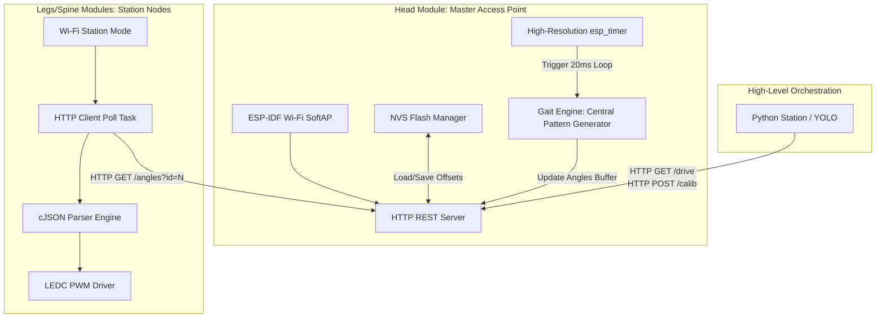
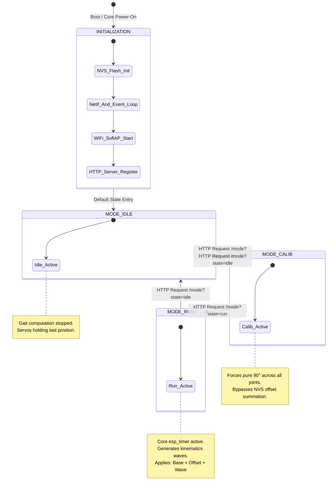
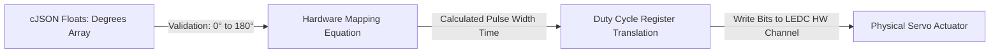
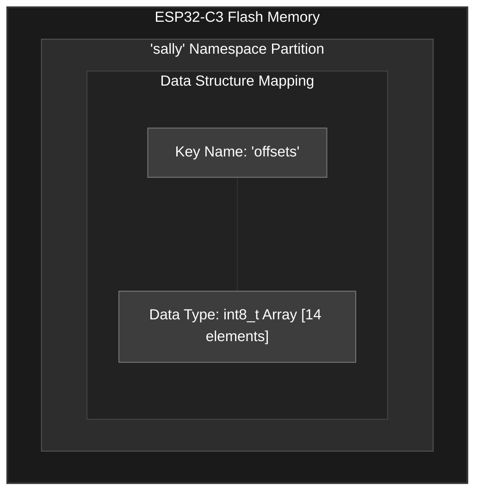

# SALLI: ESP-IDF Firmware Ecosystem

This directory contains the dual-node embedded firmware framework developed for SALLI. The entire subsystem is built using Espressif's native **ESP-IDF (IoT Development Framework) v5.1+** for the **ESP32-C3 Mini** microcontroller. By bypassing the Arduino abstraction layer, this firmware achieves microsecond-precision hardware timing, efficient multi-tasking via **FreeRTOS**, and low-overhead network serialization.

---

## Distributed Firmware Architecture

SALLI's movement and data routing are handled by two software execution profiles deployed across distinct physical units:

1. **Master Node (`Acces Point Sally`):** Acts as the centralized coordinator located in the robot's Head Module. It initializes a Wi-Fi SoftAP, hosts an HTTP REST API server, loads/saves calibration arrays from Flash memory, computes gait kinematics using deterministic timers, and distributes targeting data.
2. **Slave Node (`WIFI_Movement`):** Deployed across localized motor-driver segments. It connects to the Master SoftAP as a Station (STA), opens an HTTP client polling loop, parses joint angles, and drives hardware timers using the ESP32 LEDC peripheral.



---

## Master Node Execution & FreeRTOS Task Lifecycle

The Master firmware coordinates multiple asynchronous operations by distributing computational load across FreeRTOS task handles and hardware interrupts.

### State Machine Transitions

The system operation relies on three primary states managed by an internal enum (`run_mode_t`):

* `MODE_IDLE`: Servos are soft-locked; no traveling waves are computed.
* `MODE_CALIB`: The network forces a raw neutral output ($90^\circ$ baseline) across all channels, bypassing the calibration Lookup Tables (LUT) to isolate physical alignment errors.
* `MODE_RUN`: Active state. The high-resolution hardware timer synthesizes real-time sinewaves and updates them by injecting the saved NVS mechanical offsets.



### Deterministic Kinematic Synthesis Loop

Rather than using loose FreeRTOS task delays which suffer from scheduler jitter, the rhythmic locomotion patterns are calculated via a hardware-backed high-resolution timer interrupt (`esp_timer_handle_t`) configured to fire precisely every $\Delta t = 20\text{ ms}$ ($50\text{ Hz}$).

To enforce joint protection and limit acceleration, target values are fed through an analytical convergence function that acts as a low-pass slew rate limiter:

$$\theta_{\text{current}}(t) = \theta_{\text{current}}(t-\Delta t) + \text{clamp}\left(\theta_{\text{target}}(t) - \theta_{\text{current}}(t-\Delta t), -\Omega_{\text{max}}\cdot\Delta t, \Omega_{\text{max}}\cdot\Delta t\right)$$

Where:

* $\Omega_{\text{max}}$ represents the maximum allowable angular velocity expressed in degrees per second ($dps$).

---

## Network Protocol & API Endpoint Matrix

The Master Node exposes an embedded HTTP server listening on port `80`. Slave nodes and external base stations communicate with the robot using standardized REST endpoints.

| Endpoint | HTTP Method | Target Clients | Query Parameters / Payload JSON | Technical Behavior |
| --- | --- | --- | --- | --- |
| `/mode` | `GET` | Python GUI / Workstation | `?state=[run|calib|idle|preview]` | Transitions the global enum state machine and alters algorithmic data routing. |
| `/drive` | `GET` | Python Autonomous Loop | `?dir=[F|B|L|R]&pct=[0-100]&resp=[0-100]` | Modifies wave attributes: updates travel directions, scales overall amplitudes, and shifts steering variables ($\beta$). |
| `/calib` | `POST` | `Calibration.py` Utility | JSON payload containing an array of 14 signed integer offset parameters. | Writes calibration parameters directly into the NVS Flash partition `sally/offsets`. |
| `/angles` | `GET` | Slave `WIFI_Movement` Nodes | `?id=[0-7]` | Serializes the requested segment array from the central memory block into a JSON string format. |

### Network Payload JSON Specification (Example)

When a slave node assigned to a leg module requests data from the master via `/angles?id=4`, the Master server constructs the following structured JSON response packet:

```json
{
  "device_id": 4,
  "period": 2,
  "angles": [84.50, 92.15, 88.00, 90.00]
}

```

---

## Local Hardware Actuation (LEDC Peripheral Driver)

When a node receives its targets via network serialization, it decodes the payload using the `cJSON` component and updates its hardware profiles. The actual positioning of the analog micro-servos is controlled by translating logical degrees into raw timer ticks using the ESP32-C3 **LEDC** peripheral interface.



### Mathematical PWM Register Mapping

The hardware timing configurations are defined as follows:

* **PWM Frequency ($f_{\text{pwm}}$):** $50\text{ Hz}$ (Standard analog servo repetition control rate, equivalent to a $20\text{ ms}$ baseline window period).
* **Timer Counter Resolution ($R$):** $14\text{ bits}$ ($\text{Max Ticks} = 2^{14} - 1 = 16,383$).

The absolute pulse-width times ($T_{\text{pulse}}$) required to drive standard micro-servos are bounded between a $0.5\text{ ms}$ minimum limit and a $2.5\text{ ms}$ maximum limit:

$$T_{\text{pulse}}(\theta) = 0.5\text{ ms} + \left(\frac{\theta}{180^\circ}\right) \cdot (2.0\text{ ms})$$

To find the corresponding integer count value ($D_{\text{reg}}$) for the 14-bit duty cycle register, the embedded firmware computes the following transformation:

$$D_{\text{reg}}(\theta) = \left( \frac{T_{\text{pulse}}(\theta)}{20\text{ ms}} \right) \cdot (2^{14} - 1) = \left( \frac{0.5\text{ ms} + \frac{\theta}{180^\circ} \cdot 2.0\text{ ms}}{20\text{ ms}} \right) \cdot 16,383$$

Evaluating the linear boundary coefficients simplifies the hardware translation script to:

$$D_{\text{reg}}(\theta) = \text{round}\left( 409.575 + \theta \cdot 9.1016 \right)$$

This direct equation maps any raw input angle $\theta \in [0^\circ, 180^\circ]$ to its corresponding bit array value, enabling immediate register updates via the native API call `ledc_set_duty()`.

---

## Low-Level Memory Management: Non-Volatile Storage (NVS)

SALLI preserves its physical joint calibrations across complete power cuts by reading and writing variables into the flash chip's NVS partition.



### Flash Read / Write Operational Sequence

1. **Boot Initialization:** During `app_main`, the function `nvs_flash_init()` mounts the physical block storage. If a size mismatch error is returned, the sectors are formatted and re-initialized.
2. **Handle Allocation:** The application requests a secure communication link by calling `nvs_open("sally", NVS_READWRITE, &my_handle)`.
3. **Array Extraction:** On initialization, `nvs_get_blob(my_handle, "offsets", target_array, &length)` retrieves the signed 8-bit integer calibration array. If the key is missing, a default zero-vector is generated.
4. **Serialization and Commits:** When a configuration payload hits the `/calib` REST target, the input data array updates the active volatile registers. It is then serialized into the storage page via `nvs_set_blob()`, followed immediately by an explicit `nvs_commit()` call to flush the registers to physical memory blocks.