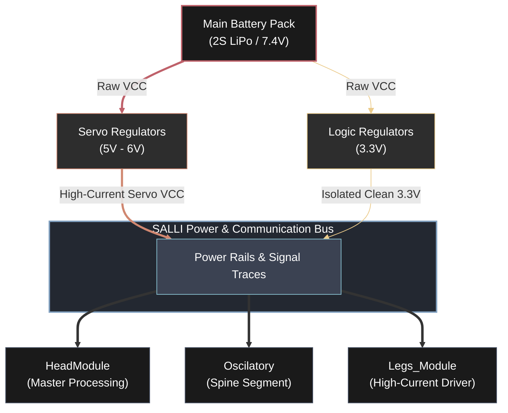

# SALLI: Custom Electronic PCBs

This directory contains the electrical designs for SALLI's custom printed circuit boards. The electronic system is engineered to solve a common pitfall in amateur robotics: messy, unreliable wiring harnesses that introduce high resistance, noise, and power failures.

---

## Electrical Architecture Overview

SALLI uses a decentralized, modular electrical bus system. Power is distributed along the spine via a ruggedized internal backbone, preventing major voltage drops from affecting the master microcontroller.

---

## Board Subsystems & Responsibilities

The electrical system is divided into four main board profiles:

### 1. `HeadModule` (Master Processing PCB)

The central board of the robot, acting as SALLI's head controller.

* **MCU Support:** Integrates the footprint for the **ESP32-C3 Mini** board.
* **Power Filtering:** Features heavy ceramic and electrolytic capacitor banks to filter out high-frequency noise induced by servo inductive kickbacks.
* **Sensor Hub:** Routes dedicated pins for IMUs (Inertial Measurement Units for tilt and balance detection) and external range sensors.

### 2. `Oscilatory` (Spine Segment PCB)

These are passive/semi-active distribution boards designed to be chain-linked together.

* **The SALLI Bus:** Passes power (VCC and GND) and communication channels downstream to consecutive modules.
* **Servo Tap:** Provides local, filtered power connectors for the local spinal deflection servo, keeping cabling lengths under $20\text{ mm}$.

### 3. `Legs_Module` (High-Current Driver Board)

Because the limbs support the entire weight of the robot and drive forward crawling forces, they demand significant active currents.

* **High-Current Traces:** Features wide copper traces capable of handling sustained currents of up to $3\text{ A}$ during crawling cycles.
* **Independent Power Regulation:** Standardizes opto-couplers or isolation resistors to prevent sudden physical motor stalls from corrupting the main microcontroller's logical operations.

### 4. `Camera` (Vision Expansion Board)

An optional expansion PCB tailored to hold camera modules (such as ESP32-CAM or specialized small SPI cameras) to enable visual-spatial telemetry.

---

## Design Guidelines

* **Trace Width Selection:** * Power paths ($VCC\_SERVO$, $GND$) are set to a minimum of `1.5 mm` width to minimize resistance and prevent thermal stress under heavy load.
* Logic lines ($TX$, $RX$, $PWM$) are kept at standard `0.254 mm` traces.

* **Decoupling Strategy:** Each module places a `100uF` electrolytic capacitor directly in parallel with the local servo power terminal, supplemented by a standard `0.1uF` ceramic capacitor close to the logic rails to handle high-frequency voltage ripples.
* **Standardized Pin Headers:** Connectors use standard, highly accessible, polarized headers (like JST-XH or XT30/XT60 for power entry) to ensure mistake-proof assembly by students.