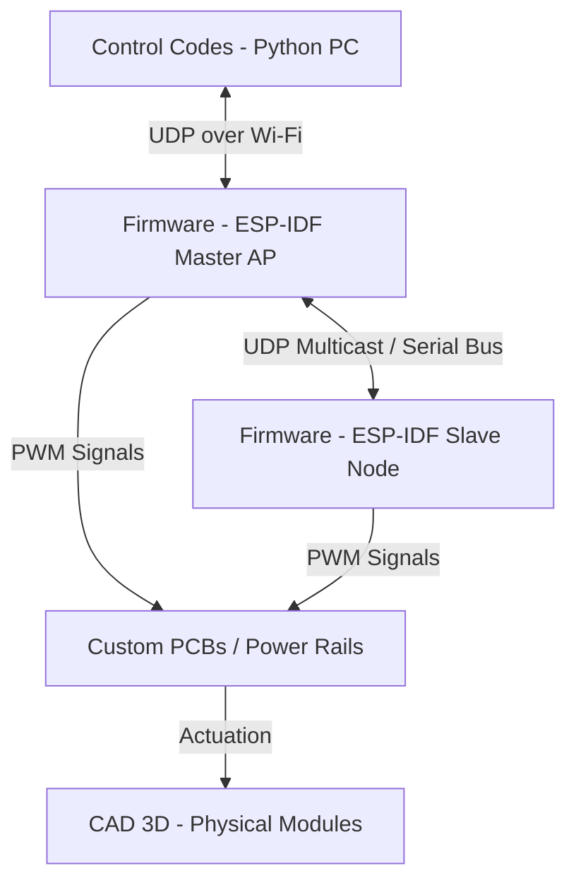

# SALLI: Salamander Autonomous Locomotion on Land Infrastructure

SALLI is an open-source, low-cost, and modular mechatronic platform designed to study bio-inspired terrestrial locomotion. Drawing inspiration from the sprawling gait of the salamander, this project integrates custom 3D-printed mechanical linkages, dedicated modular printed circuit boards (PCBs), lightweight embedded ESP-IDF firmware, and high-level Python control algorithms.


---

## Project Vision & Philosophy

Traditional robotics platforms often suffer from high manufacturing costs, complex monolithic assemblies, and poor reparability. SALLI was conceived under a different paradigm:
* **True Modularity:** Every physical segment—whether a spinal oscillator, a locomotor leg, or a sensory head—uses a standardized mechanical and electrical connection interface. Segments can be chain-linked dynamically to increase or decrease the robot's degrees of freedom (DoF).
* **Low Cost & Accessibility:** Designed to be accessible to students, researchers, and hobbyists. The structural parts are optimized for standard FDM 3D printing, and the electronics rely on budget-friendly, high-performance ESP32-C3 microcontrollers and standard micro servos.
* **Easy Maintenance & Repair:** Field repairs can be executed swiftly. Damage to a single segment does not compromise the whole robot; the offending module can be disconnected and swapped out in minutes.

---

## System Architecture

The project is structurally divided into four cohesive domains:



1. **`CAD_3D/` (Mechanical Architecture):** Multi-segment structure utilizing bio-mimetic joint limits and sprawling kinematics.
2. **`PCBs/` (Electrical Architecture):** Modular bus system delivering isolated power lines (to prevent servo-induced voltage brownouts) and standardized signal traces.
3. **`Firmware/` (Embedded Systems):** High-efficiency ESP-IDF C-code implementing an Access Point control loop and UDP-based communication over ESP32-C3 chips.
4. **`ControlCodes/` (High-Level Control & Autonomy):** Python orchestrator supporting manual teleoperation, automatic parameter identification, and servo calibration.

---

## Repository Directory Tree

```text
SALLI/
├── .gitignore                   # Global file and directory exclusions
├── README.md                    # Root-level project documentation (This file)
│
├── CAD_3D/                      # Mechanical assemblies and components
│   ├── Cabeza V3/               # Sensory head module
│   ├── Cola/                    # Stabilizing tail segment
│   ├── Ensamble Total/          # Master digital design assembly
│   ├── Módulo de Patas V3/      # Sprawling leg kinematics module
│   ├── Oscilatorio V4/          # Daisy-chainable spinal segments
│   └── Patines/                 # Passive ground contact slide-pads
│
├── ControlCodes/                # High-level Python control ecosystem
│   ├── Calibration.py           # Multi-servo offset calibration utility
│   ├── SALLI.py                 # Core autonomy and CPG state engine
│   └── Teleoperation.py         # Human-in-the-loop manual controller
│
├── Firmware/                    # Low-level ESP-IDF software
│   ├── Acces Point Sally/       # Master AP, computational control, and state processor
│   └── WIFI_Movement/           # Slave node receiver executing raw joint positions
│
└── PCBs/                        # Electrical schematic and board layouts
    ├── Camera/                  # Visual feedback capture module
    ├── HeadModule/              # Central micro-controller carrier PCB
    ├── Legs_Module/             # High-current servo driver PCB
    └── Oscilatory/              # Passive signal-passthrough spine PCB

```

---

## Biological Locomotion Model

SALLI's movement is mathematically governed by a **Central Pattern Generator (CPG)** model. This system represents networks of coupled neural oscillators that generate rhythmic patterns without sensory feedback.

The phase relation between the body segments ($i$) and limbs ($j$) is modeled using coupled differential equations:

$$\frac{d\theta_i}{dt} = 2\pi \nu_i + \sum_{j} w_{ij} \sin(\theta_j - \theta_i - \phi_{ij})$$

Where:

* $\theta_i$ represents the instantaneous phase of the $i$-th oscillator.
* $\nu_i$ is the intrinsic frequency of the segment.
* $w_{ij}$ dictates the coupling strength between neighboring segments.
* $\phi_{ij}$ is the target phase bias defining traveling waves for swimming or crawling.

This math is processed in real-time between the `ControlCodes` layer and the `Firmware` layer to ensure fluid, life-like movements.

---

## Quick Start

### 1. Requirements & Tools

* **CAD:** Autodesk Fusion 360, SolidWorks, or FreeCAD to view STEP/STL files.
* **Firmware development:** Espressif ESP-IDF SDK (v5.1 or later recommended).
* **Control Station:** Python 3.10+ with standard networking libraries.

### 2. Basic Setup

To clone the repository and initialize the project:

```bash
git clone [https://github.com/YourUsername/SALLI.git](https://github.com/YourUsername/SALLI.git)
cd SALLI

```

---

## Academic Context

This project was developed at **Universidad Autónoma de Occidente (UAO)**, Cali, Colombia, within the Faculty of Engineering. It serves as an open-source platform to advance research in bio-inspired robotics, kinetic efficiency, and distributed embedded networks.